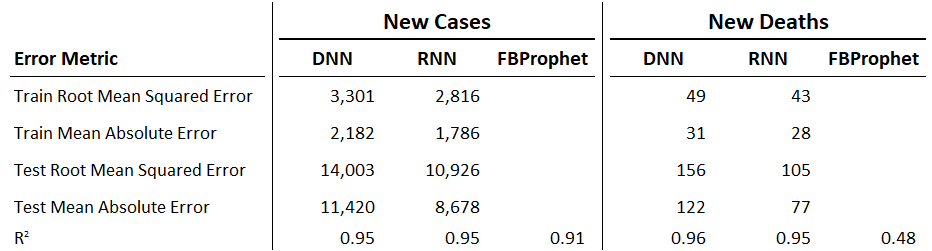

## Overview
This repository contains code for our final project, completed as part of the University of Texas at Austin - Data Analysis and Visualization bootcamp. The project will analyze data related to the Covid-19 pandemic, with the aim of producing a machine learning model that predicts the number of cases/fatalities that a given country can expect in the future.

#### Team Members:
- Mike Hankinson
- Tan Tran
- Luke Newell
- Keith Rabb

### Why did we select this topic?
The Covid-19 pandemic has impacted the lives of billions of people all over the globe. Every member of the team has been affected in some way and we would like to use the skills we have learned to contribute to a better understanding of the spread of the virus. 

### Description of the source of data
The dataset we are using is owid-covid-data.csv. Our World in Data have collated the data from a number of different sources, which can be found [here](https://github.com/owid/covid-19-data/tree/master/public/data). They source their data from the following organizations:

- COVID-19 Data Repository by the Center for Systems Science and Engineering (CSSE) at Johns Hopkins University (JHU)
- European Centre for Disease Prevention and Control (ECDC)
- Official government reports
- United Nations
- World Bank
- Global Burden of Disease

The live dataset can be found at [OurWorldinData.org](https://covid.ourworldindata.org/data/owid-covid-data.csv) and all data produced by Our World in Data are open access under the [Creative Commons BY license](https://creativecommons.org/licenses/by/4.0/). 

### Questions we hope to answer with the data
- Based on available data, how many cases can a country expect to see over the next two weeks? 
- Based on available data, how many fatalities can a country expect to see over the next two weeks?

### Description of the data exploration phase of the project
We performed a introductory analysis on COVID-19 cases and deaths in the USA, after an initial visualization of the worldwide data showed that the USA has been badly affected when compared to other countries. The team visualized the data using Matplotlib to compare the daily numbers with a weekly average. The weekly averaging smoothed out the data, enabling the team to create a smoother curve plot and removing the daily fluctuations that were created.  

### Description of the analysis phase of the project
The analysis phase of the project consisted of a comparison of different machine learning models, testing how each model was able to accurately predict COVID-19 cases and deaths in the USA. The models we tested were: ARIMA, DNN, RNN and FBProphet. Each model had slightly different requirements for analyzing the data and provided the team with different insights into the optimal forecasting method for COVID-19. Further information can be found in the 'Overview of the Machine Learning Analysis' section below.

## Technologies Used
All packages used to run the code in this project can be found in the [requirements.txt file](https://github.com/luke-c-newell/Final_Project/blob/luke-c-newell/segment-3/requirements.txt).

### Tools:
- Python
- Pandas
- Numpy
- Tensorflow
- Jupyter Notebook

### Database:  
- PostgreSQL
- pgAdmin

### Machine Learning:  
- Scikit-learn
- TensorFlow
- Keras
- FBProphet

### Vis & Analysis:  
- Matplotlib, Plotly
- ReadMe
- Google Slides
- Tableau

## Overview of the Machine Learning Analysis 
This model will attempt to answer the following questions regarding the CoVID pandemic:
- Based on available data, how many cases can a country expect to see over the next given time period?
- Based on available data, how many fatalities can a country expect to see over the next given time period?

In order to accomplish this task, we must employ a novel model type that was not presented within the Data Analytics Bootcamp.  Rather than employing classification or clustering models, this analysis must incorporate a supervised regression ML model. 

Machine Learning models are not typically applied to time series data.  Rather, they are are usually trained using supervised learning; expecting data in the form of samples with inputs and outputs. However, it is possible to perform time series forecasting using ML.  In order to do so, the time series data must be transformed into a supervised learning problem.  

### Literature Sources for Time Series ML Analysis
- [Applying Standard ML algorithms to Time-Series forecasting](https://towardsdatascience.com/preprocessing-time-series-data-for-supervised-learning-2e27493f44ae)
- [Convert a Time Series to a Supervised Learning Problem in Python](https://machinelearningmastery.com/convert-time-series-supervised-learning-problem-python/)
- [Time series forecasting](https://www.tensorflow.org/tutorials/structured_data/time_series)
- [A Quick Deep Learning Recipe: Time Series Forecasting with Keras in Python](https://towardsdatascience.com/a-quick-deep-learning-recipe-time-series-forecasting-with-keras-in-python-f759923ba64)
- [How to Make Out-of-Sample Forecasts with ARIMA in Python](https://machinelearningmastery.com/make-sample-forecasts-arima-python/)
- [Quick start Prophet](https://facebook.github.io/prophet/docs/quick_start.html)

### Procedure
1. Import dependencies
2. Import data set from provisional database
3. Preprocess Data
4. Split the dataset into training and testing. 
5. Apply a standard scaler 
6. Difference the data to make it stationary
7. Define / Develop Neural Network 
8. Fit model
9. Build features for forecasting

## Comparison of ML Models
To optimize our ML forecast, we decided to compare various models to understand which would provide the most accurate prediction of future COVID cases and deaths in the USA. After completing some research on models for time series forecasting, we arrived on these models to test: 
- [Deep Neural Network Model](https://github.com/luke-c-newell/Final_Project/blob/main/ML_Models/DNN_and_RNN_ML_Models/DNN_and_RNN_ML_Models.ipynb)
- [Recurrent Neural Network Model](https://github.com/luke-c-newell/Final_Project/blob/main/ML_Models/DNN_and_RNN_ML_Models/DNN_and_RNN_ML_Models.ipynb)
- [FBProphet](https://github.com/luke-c-newell/Final_Project/blob/luke-c-newell/segment-2/FBProphet_Model.ipynb)

You can review the code for each model via the links above!

### Description of data preprocessing
To preprocess the data for use in the machine learning models, we completed the following steps:
- Selected desired columns from the database
- Use fillna function to replace any NaN values with 0
- Convert date column to datetime datatype

### Description of feature engineering and feature selection, including the decision-making process
For all three models, we decided to complete a time series forecast plotting datetime data against two features: new_cases and new_deaths in the United States. We decided to choose these metrics as they provide the best insight into the spread of the virus and the effect it has on the country. Time series forecast models rely heavily on historical data to predict future values. As such, we are currently using just one feature for each model to predict either new cases or new deaths.

- DNN: Incorporated a helper function, convert2matrix, to reshape the dataset into the correct 2-D DNN input shape.
- RNN: Incorporated a helper function, convert2matrix, to reshape the dataset into the correct 3-D RNN input shape: (batch_size, window size, input_features).
- FBProphet: Used a dataframe containing the historical data with two columns: ds and y (date and feature).
 
### Description of training and testing data split as well as training methodologies

- DNN: For training, we used 75% of the available data minus a 'look back' window of 15 days. The testing data used the remainder of the dataset.  The model was built with one hidden layer using the rectified linear (ReLU) activation function.  The model compiled both the training and testing loss over a maximum of 100 epochs.  
- RNN: For training, we used 75% of the available data minus a 'look back' window of 15 days. The testing data used the remainder of the dataset.  Unlike DNN, the RNN model was built with two hidden layers again using the rectified linear (ReLU) activation function.  The model compiled both the training and testing loss over a maximum of 100 epochs.  
- FBProphet: The training data used a dataframe with all the historical data. For testing, a new dataframe (future) was created to store the future dates and the predicted values were then populated by the model.

### Explanation of model choice, including limitations and benefits

- DNN: The Deep Neural Network model was chosen as it works well with a complete dataset and is able to be used with univariate and multivariate data. A limitation of the model is that it also is affected by lagged correlation, but this model does capture the overall trends with a high degree of accuracy. 
- RNN: The Recurrent Neural Network is a type of artificial neural model that is specifically desgined to work with time series or sequential data.  These models are somewhat unique in that they maintain a 'memory'as they take information from prior inputs to influence the current input/output -- inputs/outputs of this model type are not independent of one another.    
- FBProphet: This model was chosen as it is a suitable model for time series forecasting, that uses past trends to predict future values. One limitation is that the model is highly affected by seasonality, which reduces the benefit as we only have ~420 days of data and so yearly trends are not able to be determined. But, the model does allow for weekly and monthly variations, which will come in particularly useful when analyzing COVID-19 metrics.

### Description of how we have trained the model thus far, and additional training we plan to conduct
- DNN: This model was trained over 100 epochs using the adam optimizer
- RNN: This model was trained over 100 epochs using the adam optimizer
- FBProphet: This model was trained using the FBProphet fit function with over 420 days of historical data

We plan to train the FBProphet Models further, as the accuracy score for the deaths model is currently much lower than desired.

### Model Accuracy Scores
 

#### R-square scores for FBProphet Models
FBProphet_Model_Cases - 0.91
FBProphet_Model_Deaths - 0.48

## Creating Dashboard Using Tableau
To visualize the data, we are using Tableau with the COVID data imported from our database in pgAdmin. We have created a number of plots that show the spread of the virus around the world, including interactive elements that are described below. From these visualizations, the user can understand which countries have been most affected by the coronavirus, where the most new cases are arising, and which countries have vaccinated the largest number of their residents.

### Tableau Landing Page
 

 
  
 
### New Covid Cases Plot
 

 
 
### New Covid Deaths Plot
 

You can find the [Interactive Dashboard here](https://public.tableau.com/profile/andy3376#!/vizhome/USANEWCOVIDCASES-TEAM9/Seg4?publish=yes) and  [here](https://public.tableau.com/profile/keith.rabb#!/vizhome/MLM_Group9/MachineLearningModel) where the user can click on the world map and select their country of choice as well as intereact with model outputs.  (Note: the Interactive Dashboards are yet to be merged into a single story board.)

### Group Presentation
- Website [Group9webpage.com](https://www.group9webpage.com/)
- Development of Storyboard in Google Slides [Group 9 Storyboard](https://docs.google.com/presentation/d/1iybh9tz-hBt0wZW32HK4HYpuZEM1wvvOt4wDN5cdlCE/edit?usp=sharing)
